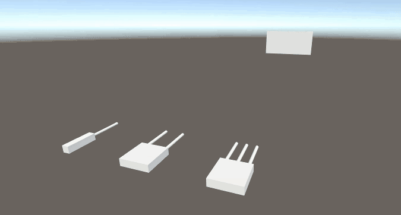
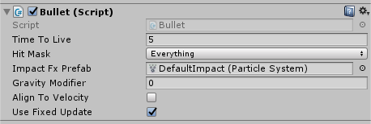
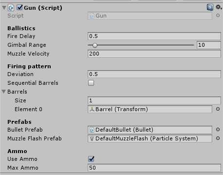
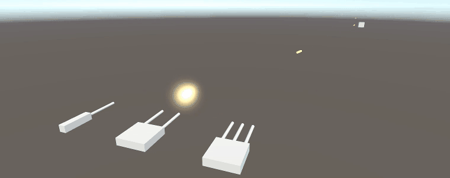

# Guns and Bullets
I frequently end up going to the most recent project I've created, then gutting the gun and bullet components to re-use only the basics of it. After that, I build upon those simplified components as I tailor them to what I'm working on.

This project is a set of generic gun and bullet components. They don't do a whole lot and are meant only as starting points for something more complex. They are designed around my usual use case of fast moving bullets fired from vehicles.



This project was built in **Unity 2017.3.1f1**.

## Download
You can either clone the repository or [download the asset package](./GunsAndBullets.unitypackage) located in the root.

## Bullets


The bullets are handled by raycasting forwards every frame. It allows for fast moving bullets to almost never tunnel through objects. I've been reusing this exact same code for years and it has served me well.

```csharp
private void MoveBullet()
{
    RaycastHit rayHit;
    Ray velocityRay = new Ray(transform.position, velocity.normalized);
    bool rayHasHit = Physics.Raycast(velocityRay, 
                                     out rayHit,
                                     velocity.magnitude * kVelocityMult * Time.deltaTime,
                                     hitMask);

    if (rayHasHit == true)
    {
        // Bullet hit something.
        // Put code here to damage the thing you hit using your components.
        DestroyBullet(rayHit.point, true);
    }
    else
    {
        // Bullet didn't hit anything, continue moving.
        transform.Translate(velocity * Time.deltaTime, Space.World);
    }
}
```

### Limitations
The code in this project is very simple. While it is generic enough to cover what I feel is 90% of use cases involving fast bullets, there are some limitations to keep in mind.

1. This solution is designed around bullets that will be traveling at fast speeds relative to their targets. If the targets travel at similar speeds, or faster, than the bullets, then it is possible for the bullet to be skipped over in a frame.
2. Neither the bullets, nor the impact effects, are pooled. Pooling is too implementation specific to include here, so keep in mind that you may want to write a pooling system for bullets if bullet spawning/destruction becomes a bottleneck.

## Guns


The guns have a couple useful features:
- `Deviation` can be added to make guns inaccurate. The value is the max error off boresight that a bullet can have.
- Using the `Gimbal Range`, guns can auto-aim to some degree. More on this below.
- Multiple barrels are supported, and can be set to fire together, or sequentially.
- Ammo usage can be toggled on/off at any time.

### Gimballing


An optional feature that I often find myself repeatedly implementing is gimballing guns. The idea behind this is to allow the gun to hit a precise point without necessarily aiming the gun directly at that point. This is very useful for things such as auto-aim, AI controlled weapons, and ensuring that guns hit the crosshair.

`Gimbal Range` describes how far off-boresight the gun can hit a specified target. To enable this feature, set the `UseGimballedAiming` property on the gun component to `true`. Use the `TargetPosition` to assign a world position for the gun to try to aim at. As long as `UseGimballedAiming` is true, the gun will try its best to hit that position.

### Limitations
As with the bullets, I feel this component is generic enough to cover 90% of the use cases I'm interested in with little to no modification. However, there is one caveat to keep in mind.

Fire rate is handled through a cooldown variable, meaning that the gun **cannot** fire faster than the update loop. At 60fps, this means the practical lower limit on `Fire Delay` is `0.0167`. At 30fps, this grows to `0.0333`. For extremely fast firing guns either the code must be extended, or workarounds such as firing multiple barrels at the same time should be put in place.

Remember that bullets are not pooled. If you're running into fire rate limitations, you might want to start thinking about setting up a pooling system, as the time Unity spends doing instantiation/destruction calls would no longer be trivial.
